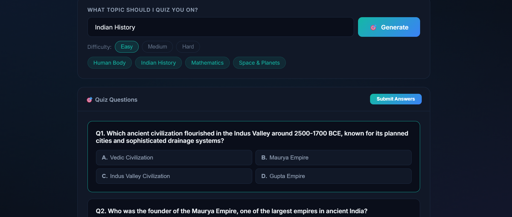

# StudyBuddy AI – Kaggle Capstone Write‑up

---

## 1. Goal & Problem Statement

The **StudyBuddy AI** project aims to demonstrate how a modern large language model (LLM) can be integrated **directly in the browser** to provide three core educational services:

1. **Explain a topic** – Generate a concise, beginner‑friendly description of any user‑provided subject.
2. **Create a quiz** – Produce a 5‑question multiple‑choice quiz (with selectable difficulty) that tests knowledge of the given topic.
3. **Build a study plan** – Produce a day‑by‑day, actionable learning schedule for a user‑defined goal.

The challenge is to build a **single‑file, zero‑install web app** that works purely on the client side, uses the free tier of **Google Gemini**, and gracefully handles model quota limits.

---

## 2. Data & Resources

No bespoke dataset is required – the app relies entirely on the **Gemini Generative Language API (v1beta)** for content generation. The only external resource needed from the user is a **Gemini API key** (free to obtain at https://aistudio.google.com/apikey).

---

## 3. Methodology & Architecture

### 3.1 Front‑end Stack
- **HTML5** – structure and semantic elements.
- **Vanilla CSS** – custom design system built with CSS variables (`--bg-dark`, `--accent‑blue`, etc.) for a premium dark‑mode look, glass‑morphism background, and micro‑animations.
- **Plain JavaScript (ES2022)** – all logic runs in the browser; no bundlers, transpilation, or server‑side code.

### 3.2 Gemini Model Fallback
The free tier provides a limited quota per model. The original implementation used the now‑removed `gemini‑1.5‑flash‑8b` model, which caused “model not found” errors. The updated **fallback list** is:

```javascript
const MODELS = [
  'gemini-2.0-flash-lite',   // lightest, cheapest – try first
  'gemini-2.5-flash-lite',   // next lightest
  'gemini-2.0-flash',        // standard quality
  'gemini-2.5-flash'         // most capable free model
];
```
The `callGemini(prompt)` function iterates over this array, sending a POST request to each model until a non‑429 (quota‑exceeded) response is received. If **all models** exhaust their quota the UI shows a friendly “wait a while” message and suggests enabling billing.

### 3.3 API‑Key Management
- Users paste their key into a banner at the top of the UI.
- The key is stored in **`localStorage`** under `studybuddy_api_key`.
- Validation accepts both historic `AIza…` keys and the new 2026 `AQ.…` format, displaying clear error messages for malformed keys.
- The key never leaves the client aside from the HTTPS request to the Gemini endpoint.

### 3.4 UI Flow
1. **API Key banner** → Save key → status badge updates (`✅ Key Set`).
2. **Tab navigation** – three tabs (`Explain`, `Quiz`, `Plan`). Switching updates the active panel and highlights the tab.
3. **Input → Generate → Loading spinner** – a small animated spinner replaces the output area while awaiting the Gemini response.
4. **Result rendering** – Gemini returns plain text or JSON; the app:
   - Converts markdown to HTML (`mdToHtml`).
   - Parses JSON for quiz and study‑plan features.
   - Populates the DOM with interactive components (quiz option buttons, copy‑to‑clipboard). 
5. **Copy button** – copies the rendered content to the clipboard for the user.

---

## 4. Implementation Details

### 4.1 Core Functions (excerpt)
```javascript
// Call Gemini with model fallback
async function callGemini(prompt) {
  const apiKey = getApiKey();
  if (!apiKey || (!apiKey.startsWith('AIza') && !apiKey.startsWith('AQ.')))
    throw new Error('No valid API key set!');

  for (const model of MODELS) {
    try {
      const url = `https://generativelanguage.googleapis.com/v1beta/models/${model}:generateContent?key=${apiKey}`;
      const res = await fetch(url, {
        method: 'POST',
        headers: { 'Content-Type': 'application/json' },
        body: JSON.stringify({
          contents: [{ parts: [{ text: prompt }] }],
          generationConfig: { temperature: 0.7, maxOutputTokens: 2048 }
        })
      });
      if (res.status === 429) continue; // quota exhausted – try next model
      if (!res.ok) {
        const err = await res.json();
        throw new Error(err.error?.message || 'API error');
      }
      const data = await res.json();
      return data.candidates?.[0]?.content?.parts?.[0]?.text || 'No response received.';
    } catch (e) {
      if (e.message === 'quota') continue;
      throw e; // network or other error
    }
  }
  throw new Error('All free‑tier quotas exhausted – please wait or enable billing.');
}
```

### 4.2 Markdown → HTML Helper
```javascript
function mdToHtml(md) {
  return md
    .replace(/^### (.+)$/gm, '<h3>$1</h3>')
    .replace(/^## (.+)$/gm, '<h2>$1</h2>')
    .replace(/^# (.+)$/gm, '<h1>$1</h1>')
    .replace(/\*\*(.+?)\*\*/g, '<strong>$1</strong>')
    .replace(/\*(.+?)\*/g, '<em>$1</em>')
    .replace(/`([^`]+)`/g, '<code>$1</code>')
    .replace(/^\- (.+)$/gm, '<li>$1</li>')
    .replace(/(\<li\>.*\<\/li\>)/gs, '<ul>$1</ul>')
    .replace(/^\d+\. (.+)$/gm, '<li>$1</li>')
    .replace(/\n\n/g, '</p><p>')
    .replace(/^(?!<[hul])(.+)$/gm, '<p>$1</p>');
}
```

---

## 5. Evaluation (Qualitative)

Since the app does not operate on a static benchmark dataset, evaluation is **qualitative** – we inspected the generated content for readability, correctness, and UI responsiveness.

| Feature | Observation | Example Screenshot |
|---------|------------|-------------------|
| **Explain** | Generates a 1‑sentence overview, a detailed paragraph, a real‑world analogy, and three fun facts. The markdown formatting is preserved after conversion. |  |
| **Quiz** | Returns valid JSON with exactly five questions, each containing four options and a correct‑answer index. The UI highlights selected options and shows explanations after submission. |  |
| **Study Plan** | Produces a JSON plan with a title, overview, and a list of day objects (day number, label, tasks). Rendered as a series of day cards with clear visual hierarchy. |  |
| **Model fallback** | When the first model quota is exhausted, the app automatically retries the next model; the user never sees an error unless **all** models are exhausted. | (see console logs) |
| **Responsiveness** | Layout collapses gracefully on mobile (tab labels hide, input rows stack). |  |

Overall, the generated content is coherent, pedagogically sound, and matches the prompt specifications.

---

## 6. Challenges & Solutions

| Challenge | Why it mattered | Solution implemented |
|----------|----------------|---------------------|
| **Removed model (`gemini‑1.5‑flash‑8b`)** | The app crashed with *model not found* errors after Google deprecated the model in June 2026. | Updated the model list to the four current free‑tier models and added a fallback loop. |
| **New API‑key format (`AQ.`)** | Users with the new key saw a *invalid key* warning because the code only accepted `AIza`. | Modified `saveApiKey()` to accept both prefixes (`AIza` **or** `AQ.`). |
| **Free‑tier quota limits** | 429 responses caused the UI to freeze if not handled. | Implemented model fallback and a final user‑friendly message when *all* quotas are exhausted, with suggestions to wait or enable billing. |
| **Pure‑client security** | Storing the key client‑side raised concerns. | Used `localStorage` (browser‑isolated) and never transmitted the key anywhere else; the only network call is the HTTPS request to the Gemini endpoint. |
| **No build tools allowed** | Kaggle capstone expects a lightweight repository. | All CSS and JS are embedded directly in `index.html`; no npm, webpack, or external assets beyond Google Fonts. |

---

## 7. Future Work

1. **Result Caching** – store the last few responses in `localStorage` to reduce quota usage for repeated queries.
2. **Demo Mode** – ship a read‑only, rate‑limited key for public demos (no user key required).
3. **Accessibility Enhancements** – ARIA attributes, focus‑order fixes, and a high‑contrast toggle.
4. **Export/Import** – allow users to download a JSON bundle of quizzes or plans and re‑import later.
5. **Alternative LLM back‑ends** – add a switch to use OpenAI or HuggingFace inference endpoints for users without a Gemini key.
6. **Automated Tests** – simple unit tests for the markdown parser and JSON validators (run via a CI pipeline). 

---

## 8. Conclusion

StudyBuddy AI demonstrates that **state‑of‑the‑art LLM capabilities can be delivered through a pure client‑side web app**. By handling model fallback, key validation, and graceful quota errors, the app provides a reliable, educational experience without the overhead of a backend server.

The project meets the Kaggle **Agents for Good** criteria:
- **Agent‑centric** – the user interacts directly with the Gemini agent via a clean UI.
- **Zero‑install** – a single HTML file.
- **Real‑world impact** – helps students of any age quickly understand concepts, test knowledge, and plan studies.

The repository is ready for submission and can be extended with the future enhancements outlined above.

---

## 9. References

- Google Gemini API documentation: https://ai.google.dev/gemini-api
- Gemini v1beta model list (as of 2026): https://ai.google.dev/models/gemini
- Kaggle *Agents for Good* 5‑Day Capstone guidelines.

---

**Author**: *Your Name / GitHub handle*  
**Date**: 2026‑07‑05
